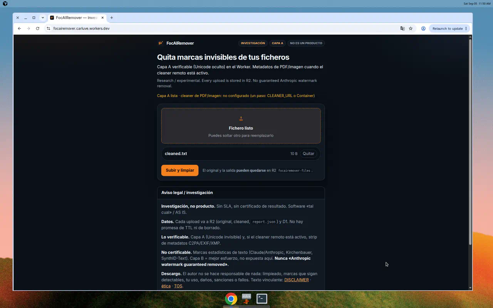
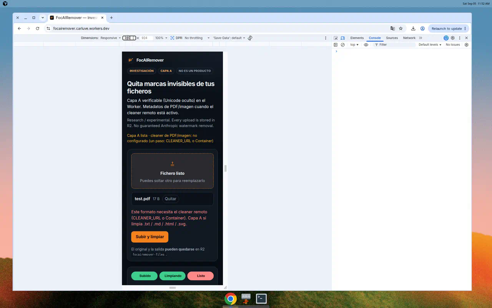
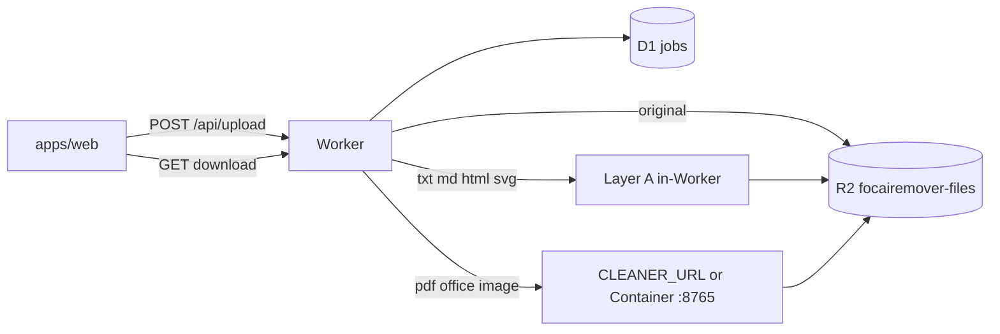

# FocAIRemover

**Investigación / experimental.** Limpia marcas de procedencia de IA que **sí se pueden verificar** (Unicode invisible, y metadatos C2PA/EXIF/XMP cuando hay cleaner remoto). No es un producto, no hay SLA, **no hay certificado de resultado**.

**Research / experimental** — not a commercial product. **Data may be stored.** The author **accepts no responsibility whatsoever.** Binding text: [docs/DISCLAIMER.md](docs/DISCLAIMER.md).

**Live:** [focairemover.carluve.workers.dev](https://focairemover.carluve.workers.dev) · cuenta Cloudflare **enterprise** `39f8ea10b94ad38470fc3c20c260efdc` · R2 `focairemover-files`



<p align="center"></p>

## Qué hace / What it does

| Capa | Qué | ¿Verificable? | Estado |
| --- | --- | --- | --- |
| **Capa A** | Unicode invisible (ZWSP, BOM, bidi overrides, …) en `.txt` `.md` `.html` `.svg` | Sí — se re-inspecciona | **Lista** (Worker, sin contenedor) |
| **Word `.docx`** | Capa A en todas las partes XML + strip de `docProps` (autor, aplicación, empresa, fechas, props IA) y de manifiestos C2PA embebidos | Sí — descomprime el `.docx` y compara | **Lista** (Worker, sin contenedor) |
| **Metadatos** | C2PA / EXIF / XMP / props de PDF, imagen, AV | Sí a nivel de contenedor | Requiere **CLEANER_URL** o Cloudflare Container |
| **Capa B** | Reescritura para debilitar marcas estadísticas (Claude/Anthropic, Kirchenbauer, SynthID-Text) | **No** — mejor esfuerzo | **No expuesta** |

**Nunca** «Anthropic watermark guaranteed removed». Un informe limpio no significa «nunca hubo IA» ni «indetectable».

Never claim **“Anthropic watermark guaranteed removed”**.

## Estado / Status

| Pieza | Producción |
| --- | --- |
| UI + Worker + R2 + D1 | Activo en workers.dev |
| Upload → job → poll → download | Activo |
| Capa A (texto) | Activo, sin secretos extra |
| Cleaner remoto (`watermarks-remover` `/clean`) | **Un paso:** `wrangler secret put CLEANER_URL` *o* descomentar Containers (Docker) |
| Capa B / GPU / detector Anthropic | Fuera de alcance |

Arquitectura: [docs/ARCHITECTURE.md](docs/ARCHITECTURE.md) · deploy: [docs/DEPLOY.md](docs/DEPLOY.md) · ética: [docs/ETHICS.md](docs/ETHICS.md) · TOS: [docs/TOS.md](docs/TOS.md)

## Arquitectura



Diseño de limpieza, contrato HTTP (`/health`, `/inspect`, `/clean`) e imagen GHCR: **[guillaumemeyer/watermarks-remover](https://github.com/guillaumemeyer/watermarks-remover)** (~20k★, MIT, v0.7.0). Este repo **no** vende el árbol Python. Inspiración de UI: [ivanusto/unmark-web](https://github.com/ivanusto/unmark-web) (**no afiliado**).

## Datos: pueden guardarse

**No asumas procesamiento local ni borrado al instante.** Todo upload va a R2 (`uploads/{jobId}/original`, `cleaned`, `report.json`) más la fila D1. Sin TTL prometido.

## Quick start

Cuenta **enterprise** only. Detalle: [docs/DEPLOY.md](docs/DEPLOY.md).

```bash
cp .dev.vars.example .dev.vars
npm install
npx wrangler d1 migrations apply focairemover-jobs --local
# opcional: docker compose up --build -d
npx wrangler dev          # http://127.0.0.1:8787
npm test
```

Producción:

```bash
export CLOUDFLARE_ACCOUNT_ID=39f8ea10b94ad38470fc3c20c260efdc
npm run deploy
# un paso para PDF/imagen:
# npx wrangler secret put CLEANER_URL
```

## Honestidad / Honesty

- Capa A y strip de metadatos son **verificables**.
- Las marcas estadísticas de texto **solo se debilitan** con Capa B — **no certificable** hasta un detector público de Anthropic.
- Solo contenido que **posees o estás autorizado a procesar**. No fraude académico. [ETHICS](docs/ETHICS.md).
- El autor **no se hace responsable de nada**. AS IS. [DISCLAIMER](docs/DISCLAIMER.md).

## Cómo contribuir

[CONTRIBUTING.md](CONTRIBUTING.md) — cómo probar, cómo no mentir en el copy.

## Licencia

MIT. [LICENSE](LICENSE) · [NOTICE](NOTICE). Conservar atribución de watermarks-remover en cualquier port de sus parsers.
